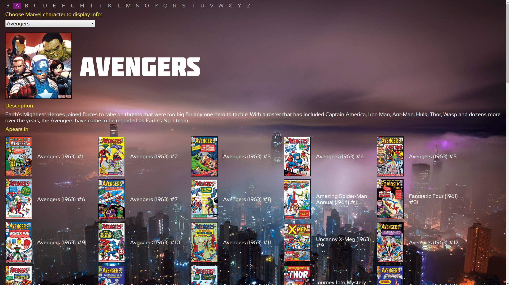
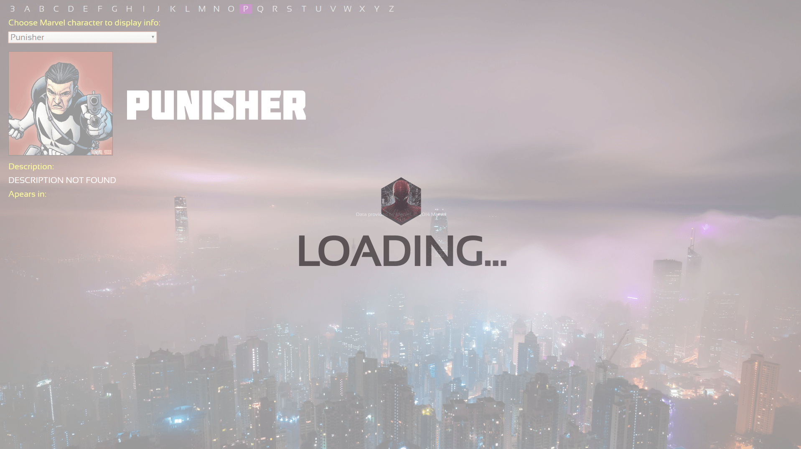

# Marvel Characters

Own project.

The aim of the project was to create interface for displaying data obtained from Marvel's public Api (https://developer.marvel.com/).

The functioning of this app is limited due to terms of Api usage imposed by provider.

Obtaining data from Marvel's Api is limited to:
* maximum 3000 database requests per day
* maximum 100 results per request

Therefore in some cases data will not be complete (eg. if character appears in more than 100 comic books or there are more than 100 characters with name starting with specified letter).

Technologies used:
* JQuery
* ES6
* HTML
* CSS

Preview:

https://nyziek.pl/projects/marvel/

Screenshots:

